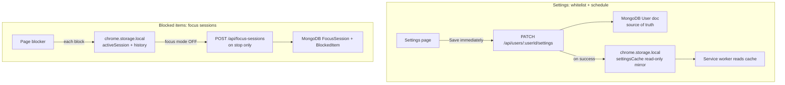
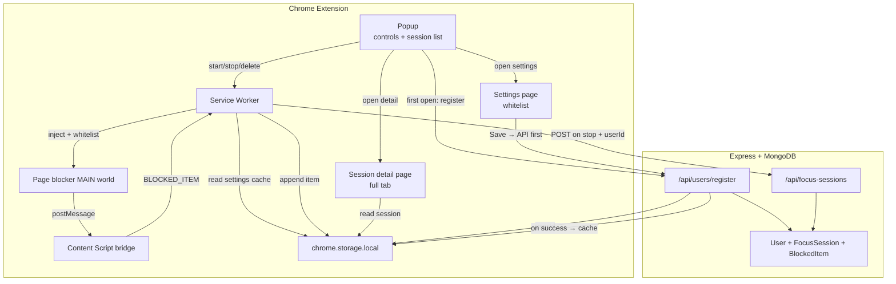
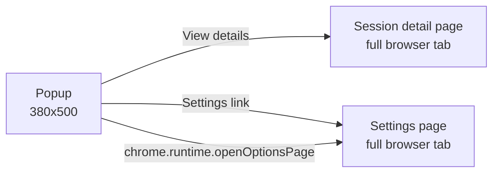

# Hybrid Focus Blocker Extension Plan

## Decisions locked in

- **Install**: Load unpacked from `extension/dist`
- **Split storage strategy** (two distinct data paths):
  - **Settings (whitelist + schedule)**: MongoDB is **source of truth**. Every save goes **immediately** to backend via API. Local storage holds a **read-only cache** updated only after successful API response (for service worker / offline read).
  - **Blocked items (notifications/popups)**: Saved to **`chrome.storage.local` only while focus mode is active**. Transferred to MongoDB via **batch API call when focus mode is turned off**. Never sent per-item during session.
- **Delete**: Remove session from local storage **and** MongoDB (if previously synced)
- **UI**: **Popup** (controls + session list) + **full-page session detail** + **settings page** (whitelist + schedule)
- **Whitelist**: Notifications never blocked on whitelisted domains during focus; popups/dialogs still blocked
- **Schedule**: Daily time slots auto-enable/disable focus mode via `chrome.alarms`
- **Source tracking**: Domain/origin/tab title on every blocked item; ranked breakdown on session detail page
- **User identity**: Email-based onboarding (no auth). Email is unique key; name is display-only. Upsert by email; all data scoped to `userId`

---

## Project layout

Add a new `extension/` folder alongside existing client/server:

```
task3_10_jun_2026/
├── extension/                    # NEW
│   ├── manifest.json
│   ├── package.json
│   ├── vite.config.js            # @crxjs/vite-plugin
│   ├── src/
│   │   ├── background/
│   │   │   └── service-worker.js
│   │   ├── content/
│   │   │   ├── bridge.js         # isolated world relay
│   │   │   └── page-blocker.js   # MAIN world overrides
│   │   ├── popup/
│   │   │   ├── index.html
│   │   │   ├── main.jsx
│   │   │   ├── Popup.jsx
│   │   │   ├── Onboarding.jsx    # first-open name + email form
│   │   │   ├── ActiveSession.jsx
│   │   │   └── SessionList.jsx
│   │   ├── pages/
│   │   │   ├── session-detail/
│   │   │   │   ├── index.html
│   │   │   │   ├── main.jsx
│   │   │   │   └── SessionDetailPage.jsx
│   │   │   └── settings/
│   │   │       ├── index.html
│   │   │       ├── main.jsx
│   │   │       └── SettingsPage.jsx
│   │   ├── components/
│   │   │   ├── SessionDetail.jsx
│   │   │   ├── SourceBreakdown.jsx
│   │   │   ├── WhitelistManager.jsx
│   │   │   └── ScheduleManager.jsx
│   │   └── shared/
│   │       ├── storage.js
│   │       ├── api.js
│   │       ├── sourceStats.js
│   │       ├── schedule.js       # compute next alarm times
│   │       ├── whitelist.js
│   │       └── constants.js
│   └── public/icons/
├── server/                       # extend existing Express app
│   └── src/
│       ├── models/
│       │   ├── User.js
│       │   ├── FocusSession.js
│       │   └── BlockedItem.js
│       ├── controllers/
│       │   ├── userController.js
│       │   └── focusSessionController.js
│       └── routes/
│           ├── routes.js         # health check (existing)
│           └── api.js            # /api/users + /api/focus-sessions
└── client/                       # unchanged for v1
```

Reuse patterns from [`task2_13_may_2026/server/src/app.js`](task2_13_may_2026/server/src/app.js) for CORS + `/api` routing. Wire the same into [`task3_10_jun_2026/server/src/app.js`](task3_10_jun_2026/server/src/app.js).

---

## Storage strategy



| Data type | When saved | Primary store | Local role |
|---|---|---|---|
| Whitelist domains | Immediately on Save | MongoDB `User.notificationWhitelist` | Cache after API success |
| Focus schedule | Immediately on Save | MongoDB `User.focusSchedule` | Cache after API success |
| Blocked items | During active session | `chrome.storage.local` only | Primary until session stops |
| Session summary | On focus stop | MongoDB `FocusSession` + `BlockedItem` | Local copy kept for fast popup UI |

---



---

## Data model

### Local storage shape (`chrome.storage.local`)

Single key `focusBlocker` to avoid scattered keys:

```js
{
  user: {
    userId: "mongo_object_id",     // from backend after register
    name: "Zeeshan",               // display only
    email: "zeeshan@company.com"   // unique key — used for re-identification
  } | null,                        // null triggers onboarding on popup open

  activeSession: {
    id: "local_sess_abc",       // generated client-side
    startedAt: 1718035200000,
    items: [/* BlockedItem[] */]
  } | null,

  sessions: [
    {
      id: "local_sess_abc",
      startedAt: 1718035200000,
      endedAt: 1718038800000,
      itemCount: 12,
      synced: true,
      backendId: "mongo_object_id",   // set after successful API sync
      sourceStats: [/* computed on stop — top domains ranked by count */]
    }
  ],

  sessionItems: {
    "local_sess_abc": [/* BlockedItem[] */]
  },

  settingsCache: {
    notificationWhitelist: ["slack.com"],   // mirror of MongoDB — NOT source of truth
    focusSchedule: {
      enabled: true,
      slots: [{ days: [1,2,3,4,5], start: "09:00", end: "17:00" }]
    },
    lastSyncedAt: 1718035200000
  }
}
```

**Important:** `settingsCache` is populated from backend on register/login and refreshed after every successful settings PATCH. The service worker and page-blocker read from this cache — never write settings directly to local storage without a successful API call first.

**Blocked session data** (local-first, synced on stop only):

**BlockedItem** (local + API payload):

```js
{
  id: "item_xyz",
  type: "notification" | "popup" | "dialog",
  source: {
    domain: "slack.com",              // normalized hostname — primary grouping key
    origin: "https://slack.com",      // scheme + host
    pageUrl: "https://slack.com/client/...",
    tabTitle: "Slack | general",      // enriched by service worker via chrome.tabs.get
    targetDomain: "ads.example.com"     // popups only: domain of URL being opened (if different)
  },
  title: "",
  body: "",
  payload: {},          // raw args (url for popup, message for alert)
  blockedAt: 1718035210000
}
```

**SourceStats** (computed on session stop and when rendering detail — not stored separately in v1):

```js
[
  {
    domain: "slack.com",
    total: 15,
    byType: { notification: 12, popup: 2, dialog: 1 },
    firstBlockedAt: 1718035210000,
    lastBlockedAt: 1718038750000
  }
]
```

Sorted by `total` descending so the most aggressive sources appear first.

### MongoDB models

**User** ([`server/src/models/User.js`](task3_10_jun_2026/server/src/models/User.js)):

- `email` (String, **unique**, indexed, lowercase) — sole unique identifier
- `name` (String) — display only; not unique (two users may share a name with different emails)
- `notificationWhitelist` (String[]) — **source of truth** for whitelist
- `focusSchedule` (embedded):
  - `enabled` (Boolean)
  - `slots` (Array): `{ days: Number[], start: String, end: String }` — e.g. `{ days: [1,2,3,4,5], start: "09:00", end: "17:00" }`
- `timestamps: true`

**FocusSession** ([`server/src/models/FocusSession.js`](task3_10_jun_2026/server/src/models/FocusSession.js)):

- `userId` (ObjectId ref User, indexed) — scopes session to a user
- `localSessionId` (String, indexed) — extension-generated id for idempotent sync
- `startedAt`, `endedAt` (Date)
- `itemCount` (Number)
- `timestamps: true`

Compound unique index: `{ userId: 1, localSessionId: 1 }`

**BlockedItem** ([`server/src/models/BlockedItem.js`](task3_10_jun_2026/server/src/models/BlockedItem.js)):

- `sessionId` (ObjectId ref FocusSession)
- `localItemId` (String)
- `type`, `title`, `body`, `payload`, `blockedAt`
- `source` (embedded subdocument):
  - `domain` (String, indexed) — for future backend aggregation queries
  - `origin`, `pageUrl`, `tabTitle`, `targetDomain`

Use `localSessionId` as upsert key so retrying sync on stop does not duplicate sessions.

Optional index: `{ sessionId: 1, "source.domain": 1 }` for efficient per-session source queries if needed later.

---

## Blocking implementation

### On session start (service worker)

1. Set `activeSession` in `chrome.storage.local`
2. Read whitelist from `settingsCache.notificationWhitelist` (cached from MongoDB)
3. Apply browser-level blocks via `chrome.contentSettings`:
   - `notifications.set({ primaryPattern: '<all_urls>', setting: 'block' })`
   - `popups.set({ primaryPattern: '<all_urls>', setting: 'block' })`
   - For **each whitelisted domain**, override with allow (notifications only):
     - `notifications.set({ primaryPattern: '*://*.domain.com/*', setting: 'allow' })`
     - `notifications.set({ primaryPattern: '*://domain.com/*', setting: 'allow' })`
4. Inject content scripts on all tabs, passing current whitelist to page-blocker (via bridge `postMessage` or `executeScript` args)
5. Listen to `chrome.tabs.onUpdated` to inject on newly loaded tabs while active
6. Set badge `ON` via `chrome.action.setBadgeText`

### Whitelist rules

- **Scope**: notifications only — whitelisted domains still have popups and dialogs blocked during focus mode
- **Matching** ([`whitelist.js`](task3_10_jun_2026/extension/src/shared/whitelist.js)): hostname matches if equal to whitelist entry OR is a subdomain (e.g. `app.slack.com` matches `slack.com`)
- **Normalization on save**: lowercase, strip `www.`, reject invalid entries
- **Live update**: settings save → API first → cache update → service worker re-applies rules

### Scheduled focus (`chrome.alarms`)

- Requires `"alarms"` permission in manifest
- Service worker reads `settingsCache.focusSchedule` (from MongoDB)
- On settings save (API success): call `scheduleNextAlarms()` — register next start/end alarm
- On `chrome.alarms.onAlarm`: `focus-start` → `startFocusSession({ source: 'schedule' })`; `focus-end` → `stopFocusSession({ source: 'schedule' })`
- On `chrome.runtime.onStartup` / `onInstalled`: if current time falls inside a slot → auto-start; else schedule next alarms
- Limitation: requires Chrome to be open; missed alarms caught on startup window check
- Session metadata: `startedBy: 'manual' | 'schedule'`

[`schedule.js`](task3_10_jun_2026/extension/src/shared/schedule.js): compute next start/end timestamps from slots array.

### Page blocker (MAIN world)

Override and report via `window.postMessage`. Every blocked event **must include source identity** captured from the page/frame context:

```js
function captureSource(targetUrl) {
  return {
    domain: location.hostname,
    origin: location.origin,
    pageUrl: location.href,
    targetDomain: targetUrl ? new URL(targetUrl, location.href).hostname : null
  };
}
```

Overrides (skip blocking when `isWhitelisted(location.hostname, whitelist)` — **notifications only**):

- `window.Notification` — if whitelisted: call original; else capture + block
- `Notification.requestPermission` — if whitelisted: call original; else return `'denied'`
- `window.open` — always capture + block (whitelist does not apply)
- `window.alert` / `confirm` / `prompt` — always capture + block (whitelist does not apply)

Whitelist is synced to page-blocker via bridge message `WHITELIST_UPDATE` on inject and on settings save.

Works per-frame: if an iframe triggers a notification, `location.hostname` correctly identifies the iframe's origin, not just the top-level tab.

### Content script bridge (isolated world)

[`bridge.js`](task3_10_jun_2026/extension/src/content/bridge.js) listens for `postMessage`, validates `source`, forwards to service worker via `chrome.runtime.sendMessage` including `tabId` and `frameId`.

### On blocked item (service worker)

1. Enrich source with tab metadata: `chrome.tabs.get(tabId)` → attach `tabTitle` and confirm `pageUrl` if top-frame
2. Normalize domain (lowercase, strip `www.` prefix for consistent grouping)
3. Append full item to `activeSession.items` in `chrome.storage.local` — **no API call**
4. Increment badge count

### On session stop (service worker)

1. Compute `sourceStats` via [`sourceStats.js`](task3_10_jun_2026/extension/src/shared/sourceStats.js) from all session items
2. Move `activeSession` → `sessions` + `sessionItems` in local storage; attach `sourceStats` to session summary; clear `activeSession`
3. Clear `chrome.contentSettings` overrides
4. Remove/invalidate injected blockers (reload scripts or set a flag checked by page-blocker)
5. **Batch sync** to backend (items include full `source` object; see API below)
6. On success: mark `synced: true`, store `backendId`
7. On failure: keep local data, set `synced: false` — popup shows retry option

---

## Backend API

Mount at `/api` in [`server/src/app.js`](task3_10_jun_2026/server/src/app.js). Add CORS allowing extension origin (`origin: true` in dev, same as task2).

### Users

| Method | Route | Purpose |
|---|---|---|
| `POST` | `/api/users/register` | Upsert by email; return user + settings (whitelist + schedule) |
| `PATCH` | `/api/users/:userId/settings` | **Immediately** save whitelist and/or schedule to MongoDB |

**PATCH `/api/users/:userId/settings` body** (partial update allowed):

```json
{
  "notificationWhitelist": ["slack.com", "calendar.google.com"],
  "focusSchedule": {
    "enabled": true,
    "slots": [{ "days": [1,2,3,4,5], "start": "09:00", "end": "17:00" }]
  }
}
```

**Response:** updated settings object. Extension writes response to `settingsCache` in local storage, then notifies service worker.

**Register response** includes full settings so extension can hydrate cache on first login:

```json
{
  "userId": "665abc...",
  "name": "Zeeshan",
  "email": "zeeshan@company.com",
  "notificationWhitelist": [],
  "focusSchedule": { "enabled": false, "slots": [] },
  "isReturningUser": true
}
```

Logic: `findOneAndUpdate({ email }, { name, email }, { upsert: true, new: true })`. Same email always returns same `userId`. Update `name` if changed. Set `isReturningUser: true` if user already existed.

No password, no JWT — `userId` sent by extension on subsequent requests (acceptable for internal load-unpacked v1).

### Focus sessions

| Method | Route | Purpose |
|---|---|---|
| `POST` | `/api/focus-sessions` | Create session + all blocked items (on stop) |
| `GET` | `/api/focus-sessions` | List sessions for a user (optional; popup reads local first) |
| `GET` | `/api/focus-sessions/:id/items` | Get items for a session (fallback if local cleared) |
| `DELETE` | `/api/focus-sessions/:id` | Delete session + cascade delete blocked items |

**POST body** (batch on stop):

```json
{
  "userId": "665abc...",
  "localSessionId": "local_sess_abc",
  "startedAt": "2026-06-10T10:00:00.000Z",
  "endedAt": "2026-06-10T11:00:00.000Z",
  "items": [ /* BlockedItem[] */ ]
}
```

Controller uses `findOneAndUpdate({ userId, localSessionId }, ..., { upsert: true })` for idempotency.

Add `API_BASE_URL` constant in extension (default `http://localhost:5000`) — configurable later via settings page if needed.

---

## Extension UI

Three React entry points (CRXJS multi-page build):



### Popup ([`popup/Popup.jsx`](task3_10_jun_2026/extension/src/popup/Popup.jsx)) — compact controls only

Gate all views behind user check: if `focusBlocker.user` is null → show onboarding.

**Onboarding** ([`Onboarding.jsx`](task3_10_jun_2026/extension/src/popup/Onboarding.jsx)) — shown on first open or after "Switch user":

- Form fields: **Name** (text), **Email** (email input)
- Validation: non-empty name, valid email format
- Submit → `POST /api/users/register` → save `{ userId, name, email }` to `chrome.storage.local`
- If `isReturningUser: true` → show "Welcome back, {name}" toast before proceeding
- Same email on reinstall/new browser → same `userId`, prior backend sessions recoverable via API fallback
- Name is **not** unique — only email is the identity key

Once registered, two views toggled by state:

- **Active session** ([`ActiveSession.jsx`](task3_10_jun_2026/extension/src/popup/ActiveSession.jsx)): greeting with user name, Start/Stop focus, elapsed timer, live blocked count, latest 5 items
- **Session list** ([`SessionList.jsx`](task3_10_jun_2026/extension/src/popup/SessionList.jsx)): past sessions with date, duration, item count, sync badge, delete button
  - **View details** button → opens session detail page in new tab
  - Footer: **Settings** link + **Switch user** (clears local `user`, shows onboarding again)

Open detail page:

```js
chrome.tabs.create({
  url: chrome.runtime.getURL(`src/pages/session-detail/index.html?sessionId=${id}`)
});
```

Popup dimensions: ~380px wide, max-height ~500px with internal scroll.

### Session detail page ([`pages/session-detail/`](task3_10_jun_2026/extension/src/pages/session-detail/)) — full tab

Full-width React page for deep inspection. Reads `sessionId` from URL query param, loads data from `chrome.storage.local`.

**Section 1 — Source breakdown** ([`SourceBreakdown.jsx`](task3_10_jun_2026/extension/src/components/SourceBreakdown.jsx)):

- Header: "Top disturbance sources"
- Ranked list by blocked count (most aggressive first)
- Each row: domain, total count, mini breakdown (e.g. `12 notifications · 2 popups`)
- Horizontal bar showing relative share of total blocks
- Click domain row → filters item list below

**Section 2 — Blocked items** ([`SessionDetail.jsx`](task3_10_jun_2026/extension/src/components/SessionDetail.jsx)):

- Filter tabs: All | Notifications | Popups | Dialogs
- Full scrollable item list with source domain, title/body/url, page URL, timestamp
- Session header: date range, duration, total blocked, sync status

### Settings page ([`pages/settings/`](task3_10_jun_2026/extension/src/pages/settings/)) — full tab

Registered as `options_page` in manifest.

**Save flow (both whitelist and schedule):**
1. User clicks Save
2. `PATCH /api/users/:userId/settings` — **MongoDB updated immediately**
3. On API success → write response to `settingsCache` in local storage
4. Notify service worker → re-apply whitelist rules + reschedule alarms
5. On API failure → show error, do **not** update local cache

[`WhitelistManager.jsx`](task3_10_jun_2026/extension/src/components/WhitelistManager.jsx):
- Add/remove domains; notifications-only exemption
- Loads initial values from `settingsCache` (hydrated from backend on login)

[`ScheduleManager.jsx`](task3_10_jun_2026/extension/src/components/ScheduleManager.jsx):
- Toggle: enable scheduled focus
- Add/remove time slots: days of week + start/end time
- Preview: "Next session: Today 9:00 AM – 5:00 PM"
- Loads initial values from `settingsCache`

Shows current user name + email at top. Separate Save buttons or single Save for both sections.

[`sourceStats.js`](task3_10_jun_2026/extension/src/shared/sourceStats.js) — shared aggregation helper used on session detail page and at session stop.

### Delete flow

1. User confirms delete in popup
2. Service worker removes session from `sessions` + `sessionItems` in local storage
3. If `backendId` exists → `DELETE /api/focus-sessions/:backendId`
4. Refresh popup state

---

## Manifest permissions

```json
{
  "manifest_version": 3,
  "permissions": ["storage", "scripting", "tabs", "contentSettings", "alarms"],
  "host_permissions": ["<all_urls>"],
  "background": { "service_worker": "src/background/service-worker.js", "type": "module" },
  "action": { "default_popup": "src/popup/index.html" },
  "options_page": "src/pages/settings/index.html"
}
```

Add `unlimitedStorage` only if testing shows quota issues.

---

## Build and dev workflow

1. `cd extension && npm install && npm run dev` — CRXJS builds to `dist/`
2. `chrome://extensions` → Developer mode → **Load unpacked** → select `extension/dist`
3. `cd server && npm run dev` — Express on port 5000
4. After code changes: extension auto-reloads (CRXJS) or manual reload on extension card

**Docs**: [CRXJS React setup](https://crxjs.dev/vite-plugin/getting-started/react)

---

## Implementation phases

### Phase 1 — Extension scaffold + user onboarding
- Create `extension/` with Vite + `@crxjs/vite-plugin` + React popup shell
- Minimal service worker + manifest
- `User` model + `POST /api/users/register` on server
- Onboarding form in popup; save `userId` locally; gate app behind user check
- Verify load unpacked works

### Phase 2 — Local storage + session lifecycle
- Implement [`storage.js`](task3_10_jun_2026/extension/src/shared/storage.js) helpers (include `user` in schema)
- Start/stop session in service worker; include `userId` in sync payload
- Popup shows active state and can start/stop

### Phase 3 — Blocking scripts
- `page-blocker.js` + `bridge.js` + injection on all tabs
- Whitelist-aware notification overrides; popups/dialogs always blocked
- `chrome.contentSettings` block all + per-domain notification allow rules for whitelist
- Capture source on every block; enrich with `tabTitle` in service worker
- Append blocked items to `activeSession.items` in local storage

### Phase 4 — Popup + full pages UI
- Popup: ActiveSession + SessionList
- Session detail page: SourceBreakdown + blocked item list
- Settings page: WhitelistManager + ScheduleManager — **API-first save**
- `sourceStats.js`, `whitelist.js`, `schedule.js` helpers

### Phase 5 — Backend
- Mongoose models (User with focusSchedule, FocusSession, BlockedItem)
- Unified `PATCH /api/users/:userId/settings` for immediate settings persistence
- Batch `POST /api/focus-sessions` on stop only for blocked items
- CORS, register upsert, DELETE on session delete

### Phase 6 — Test and polish
- Test blocking, whitelist exemption, scheduled auto start/stop
- Test settings save fails gracefully (no local cache update)
- Test session batch sync on stop; retry on failure
- SPA re-injection, offline session stop, load-unpacked workflow

---

## Key files to modify/create

| File | Action |
|---|---|
| [`task3_10_jun_2026/extension/`](task3_10_jun_2026/extension/) | Create entire extension |
| [`task3_10_jun_2026/server/src/app.js`](task3_10_jun_2026/server/src/app.js) | Add CORS + `/api` mount |
| [`task3_10_jun_2026/server/src/routes/api.js`](task3_10_jun_2026/server/src/routes/api.js) | New focus session routes |
| [`task3_10_jun_2026/server/src/models/User.js`](task3_10_jun_2026/server/src/models/User.js) | New model |
| [`task3_10_jun_2026/server/src/models/FocusSession.js`](task3_10_jun_2026/server/src/models/FocusSession.js) | New model |
| [`task3_10_jun_2026/server/src/models/BlockedItem.js`](task3_10_jun_2026/server/src/models/BlockedItem.js) | New model |
| [`task3_10_jun_2026/server/src/controllers/userController.js`](task3_10_jun_2026/server/src/controllers/userController.js) | Register + whitelist |

[`client/`](task3_10_jun_2026/client/) stays unchanged for v1 — all UX lives in the extension (popup + full pages).

---

## Risks and mitigations

| Risk | Mitigation |
|---|---|
| Popup too small for long item lists | Session detail moved to full tab page |
| Settings API fails on save | Do not update local cache; show error; blocking uses last known good cache |
| Settings API down on login | Block settings page save; allow focus with empty whitelist if cache empty |
| Session sync fails on stop | Keep full session in local storage; show "Sync failed — Retry" |
| Page blocker injected too late | Inject at `document_start`; re-inject on `tabs.onUpdated` status `loading` |
| Delete backend fails | Still delete locally; toast "Removed locally, server delete failed" |
| Duplicate sessions on retry | Upsert by `localSessionId` on POST |
| Same domain across subdomains | Whitelist uses subdomain matching; stats group by exact hostname |
| iframe notifications attributed wrong | page-blocker runs per-frame; `location.hostname` in iframe context is correct |
| Whitelist bypass via iframe from non-whitelisted parent | Check iframe's own hostname; parent domain does not grant whitelist to iframe |
| contentSettings allow rule not applied in time | Also check whitelist in page-blocker JS override as second layer |
| User claims wrong email / no auth | Acceptable for internal v1; add auth later if needed |
| Local storage cleared, user re-registers same email | Backend upsert returns same `userId`; local sessions lost but backend history recoverable via API |
| Two people same name, different emails | Allowed — only email is unique |
